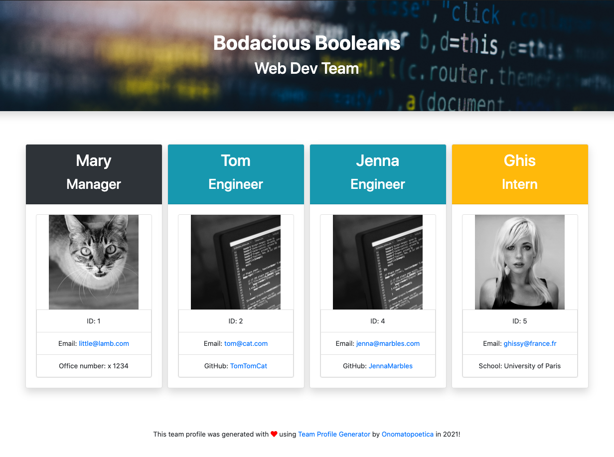

# Team Profile Generator 
A command line application that dynamically generates a professional team profile HTML file from a user's input using Inquirer npm. 

         <br> 
    
## Project Links
[Repo Link](https://github.com/onomatopoetica/team-profile-generator) <br>
**NOTE:** Since this application runs in the command line, it cannot be deployed on GitHub. Please see the **Demo** section for an overview of its functionality and the **Getting Started** section for more information regarding installation, usage, contribution guidelines, tests and where to go for questions.
    
## Table of Contents
1. [About The Project](#About-The-Project)
1. [Project Links](#Project-Links)
1. [Demo](#Demo)
1. [Getting Started](#Getting-Started)
1. [Installation](#Installation)
1. [Usage](#Usage)
1. [Tests](#Tests)
1. [Contribution Guidelines](#Contribution-Guidelines)
1. [Questions](#Questions)
1. [Project Status](#Project-Status)
1. [License](#License)
    
## About The Project

One of the most important aspects of programming is writing code that is readable, reliable and maintainable. Oftentimes, *how* we design our code is just as important as the code itself. In this project, the challenge was to build a Node CLI that takes in information about employees and generates an HTML webpage that displays summaries for each person. Since testing is a key piece in making code maintainable, the application was required to pass all unit tests.

The project scope was to create an application that dynamically generates a professional HTML file from a user's input. The application prompts the user for information about the team manager and information about the manager's team members. A user can input any number of team members which may be a mix of engineers and interns. When all unit tests have passed and the user has completed building the team, the application will create an HTML file that displays a nicely formatted team roster based on the information provided.

The dependencies are, [jest](https://jestjs.io/) for running the provided tests, and [inquirer](https://www.npmjs.com/package/inquirer) for collecting input from the user.

The application will be invoked by using the following in the command line:

```
node app.js
```
Because this application cannot be deployed on GitHub, a walkthrough video demonstrates its functionality below. 

## Demo

#### The following is a video of the team profile generator application performance and its functionality:

[See how it works!](https://drive.google.com/file/d/13plXCnBC-A0GcJcrp1zmYb16pvPKj6oj/view?usp=sharing)  

#### The following is a brief overview of the application in operation and rendering of generated team profile. See full video demonstration on "See how it works!" link above: 
    
 

#### The following is a screenshot of the application and overview of its functionality: <br>


    
## User Story
```
As a manager
I want to generate a webpage that displays my team's basic info
so that I have quick access to emails and GitHub profiles
```

## Acceptance Criteria

```
GIVEN a command-line application that accepts user input
WHEN I install all of the application dependencies, then I run unit tests to confirm they are all passing
WHEN I am prompted for information about my web development team 
THEN a high-quality, professional HTML file is generated displaying information about the team manager and team members
WHEN I use the Inquirer npm package to prompt the user for their email, id, and specific information based on their role with the company (for instance, an intern may provide their school, whereas an engineer may provide their GitHub username)
THEN this information is displayed in the generated team profile
WHEN I am asked whether I want to add any additional team members
THEN I can answer I am finished entering team members
THEN my team profile is generated with all of my team members and corresponding information in an HTML file for immediate viewing
```

## Getting Started
    
#### Languages and libraries used in this project:
* HTML/CSS
* JavaScript 
* Node.js
* Inquirer npm
* Jest 
    
#### Installation: 
```  
git clone - https://github.com/onomatopoetica/team-profile-generator.git
```
#### Usage 
```
The project is a command line application using Inquirer npm which dynamically generates an HTML file from user's input. 
See demo video above for more information on how it works.
```
#### Tests
```
Enter command 'npm install' after cloning the repo. The application will be invoked by using the following in the command line: 'node app.js'. Enter command: 'npm run test' for jest (https://jestjs.io/) to run the app tests.
```    
#### Contribution Guidelines
```
When contributing to this repository, please first discuss the change you wish to make via issue or email with the project team. See contact details below.
```
## Questions 
#### Connect with the project team: [Onomatopoetica](https://github.com/onomatopoetica)
   
<details>
    <summary>Contact</summary>
    jendotb@gmail.com
</details>

## Project Status
<details>
    <summary>Current Project Activity</summary>
    Active
</details>
    
## License
#### Distributed under the MIT License. See `LICENSE` for more information.

##### This README was generated with :hearts:&nbsp; by [Good README Generator](https://github.com/onomatopoetica/Good-README-Generator).
